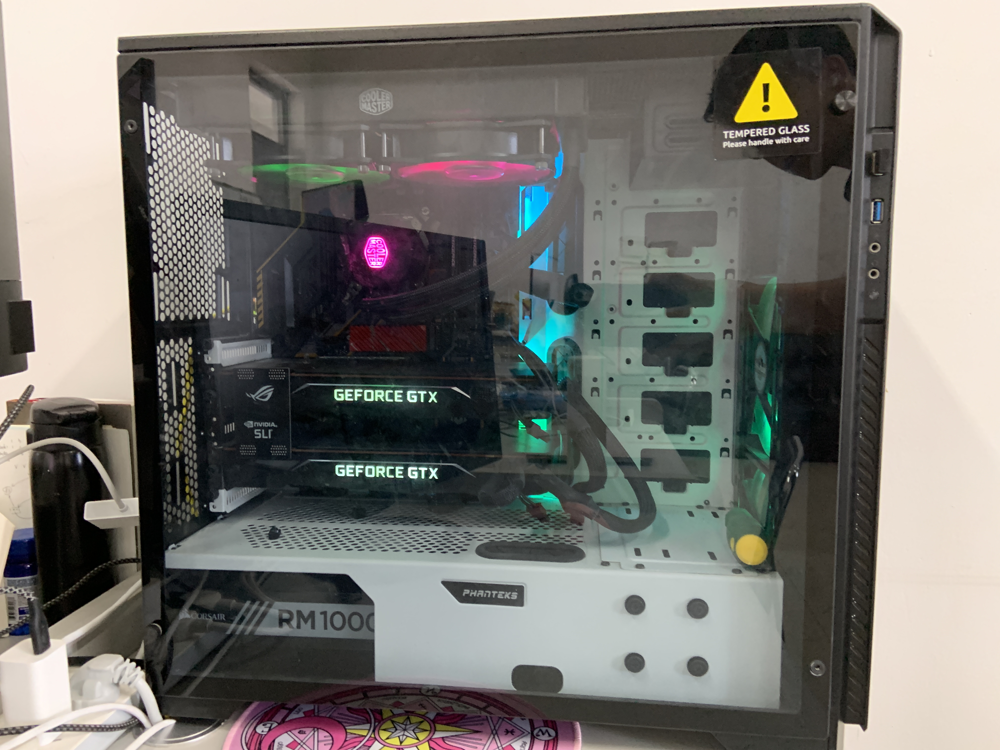
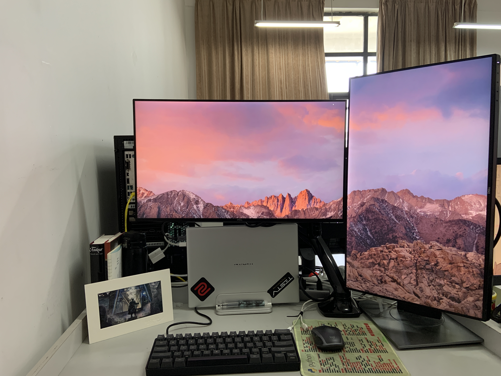

### some captures of lib

 

#### **GPU servers**

双Nvidia Titan XP显卡GPU服务器

#### **Workspace settings**

工作台配置

 

### Team Construction

 

- 2021-06-07, [**Record of a nice afternoon**](../blogs/2021-06/dinner_with_liu)
